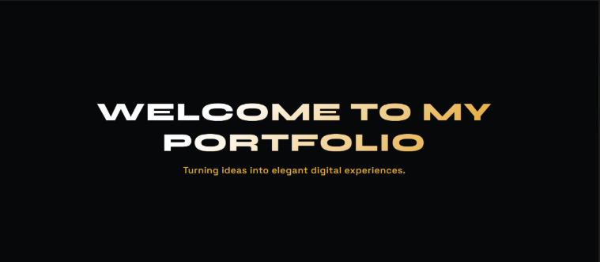

  

# 🌟 Personal Portfolio — Umm-e-Hani Kamal

  

  <strong>Detail-oriented Full Stack Web Developer & AI/ML Enthusiast based in Karachi, Pakistan.</strong> 
  Crafting high-performance web applications, modern UI/UX architectures, and intelligent AI-driven solutions[cite: 1].

  
  
  

---

## 💫 About Me

I am a dedicated **Full Stack Web Developer** with hands-on experience across front-end design, back-end web systems, and AI API integrations[cite: 1]. As **Co-Founder at DevIgnite Studio**, I blend creative UI designs with robust backend logic to build seamless web applications[cite: 1]. 

- 🎓 Pursuing **BS in Data Science** at Sir Syed University of Engineering & Technology (SSUET)[cite: 1].
- 📜 Completing **Diploma in Web Development** at Aptech Learning[cite: 1].
- 🤖 Passionate about building intelligent web apps powered by Large Language Models (LLMs) & Machine Learning[cite: 1].

---

## ⚡ Technical Skills & Ecosystem

### 🎨 Front-End Development

  
  
  
  
  
  
  

### ⚙️ Back-End & Databases

  
  
  
  
  
  
  
  
  

### 🤖 AI, ML & Integrations

  
  
  
  
  

### 🛠️ CMS, Tools & Workflows

  
  
  
  
  
  

---

## 🚀 Featured Projects

### 🧠 ExamMate AI — AI-Powered Exam Preparation Platform
> **Tech Stack:** `Python` | `Flask` | `Gemini API` | `Groq API` | `Machine Learning` | `NLP`[cite: 1]

- Built a full-stack AI web app featuring automated MCQ generation, past paper solving, and AI notes summarization[cite: 1].
- Integrated ML-driven performance analytics and adaptive quiz logic[cite: 1].
- Configured multi-API fallback architecture (Groq primary, Claude Haiku fallback) for high reliability[cite: 1].

---

### 🚗 Worldwide Car Booking Platform
> **Tech Stack:** `HTML5/CSS3` | `JavaScript` | `PHP` | `MySQL`[cite: 1]

- Client project delivering a worldwide car browsing and online reservation portal[cite: 1].
- Features automated PDF booking downloads and an integrated second-hand car marketplace[cite: 1].

---

### 🛍️ E-Commerce Fashion & Beauty Store
> **Tech Stack:** `WordPress` | `WooCommerce` | `Custom CSS`[cite: 1]

- Developed a custom online retail store with full product catalogs, shopping cart management, and payment checkout integration[cite: 1].

---

### 🎨 Art Gallery Management System
> **Tech Stack:** `ASP.NET Core MVC` | `C#` | `SQL Server`[cite: 1]

- Dynamic enterprise web platform for gallery inventory tracking, artist showcase, and exhibition scheduling[cite: 1].

---

### 🌐 DevIgnite Studio Website
> **Tech Stack:** `HTML5` | `CSS3` | `JavaScript`[cite: 1]

- Official digital agency showcase site presenting custom web engineering and design service packages[cite: 1].

---

## 🎓 Education & Certifications

- 🎓 **BS in Data Science** — Sir Syed University of Engineering & Technology (SSUET) *(In Progress)*[cite: 1]
- 📜 **Diploma in Web Development** — Aptech Learning *(2024 - Present)*[cite: 1]
- 🏆 **Certifications:**
  - *Basics of Python Programming* — UniAthena (UK)[cite: 1]
  - *Basics of Digital Marketing* — UniAthena (UK)[cite: 1]
  - *Basics of Multinational Enterprises* — UniAthena (UK)[cite: 1]

---

## 📊 GitHub Profile Overview

  
  

---

## 📬 Contact & Connect

  📧 <strong>Email:</strong> <a href="mailto:hanikamal700@gmail.com">hanikamal700@gmail.com</a> 
  🌐 <strong>Live Portfolio:</strong> <a href="https://ummehani2006.github.io/Portfolio-/">ummehani2006.github.io/Portfolio-/</a> 
  💼 <strong>LinkedIn:</strong> <a href="https://www.linkedin.com/in/umm-e-hani-13a156367">Umm-e-Hani Profile</a> 
  🐙 <strong>GitHub:</strong> <a href="https://github.com/ummehani2006">@ummehani2006</a>

---

  Built with ❤️ by Umm-e-Hani Kamal

